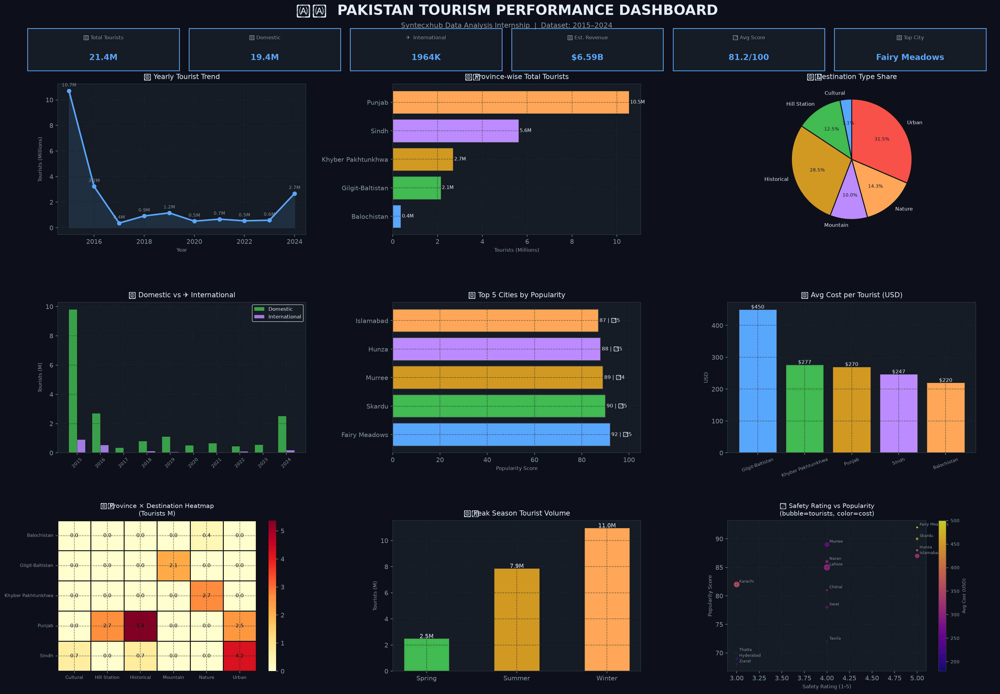

# Syntecxhub_Pakistan_Tourism_Analysis
# Pakistan Tourism Performance Dashboard 🇵🇰

---

## 📌 Overview

A comprehensive **Data Analysis & Visualization Dashboard** built on Pakistan's tourism dataset spanning **2015 to 2024**. This project uncovers key trends in domestic and international tourism, revenue patterns, regional performance, and destination popularity across Pakistan's major provinces.

> **Syntecxhub Data Analysis Internship — Task 1 | Project 1**

---

## 🖼️ Dashboard Preview

---

## 📊 Key Performance Indicators

| Metric | Value |
|--------|-------|
| 👥 Total Tourists (2015–2024) | 21,364,000 |
| 🏠 Domestic Tourists | 19,400,000 |
| ✈️ International Tourists | 1,964,000 |
| 💰 Estimated Revenue | $6.59 Billion USD |
| ⭐ Average Popularity Score | 81.2 / 100 |
| 🏆 Highest Rated City | Fairy Meadows (Score: 92) |
| 🗺️ Top Province by Tourists | Punjab |
| 🌍 International Tourist Share | 9.2% |

---

## 📈 Dashboard Visualizations

| # | Chart | Type | Insight |
|---|-------|------|---------|
| 1 | Yearly Tourist Trend | Line Chart | Growth pattern 2015–2024 |
| 2 | Province-wise Tourists | Horizontal Bar | Regional comparison |
| 3 | Destination Type Share | Pie Chart | Mountain, Nature, Urban etc. |
| 4 | Domestic vs International | Grouped Bar | Year-wise breakdown |
| 5 | Top 5 Cities by Popularity | Bar Chart | Best destinations |
| 6 | Average Cost per Province | Bar Chart | Cost comparison |
| 7 | Province × Destination Heatmap | Heatmap | Cross analysis |
| 8 | Peak Season Distribution | Bar Chart | Seasonal patterns |
| 9 | Safety Rating vs Popularity | Bubble Chart | Risk vs reward |

---

## 🛠️ Tech Stack
---

## 🗂️ Repository Structure

---

## ⚙️ Installation & Usage

**1. Clone the repository**
git clone https://github.com/SanaFayyaz12/Syntecxhub_Pakistan_Tourism_Analysis.git

cd Syntecxhub_Pakistan_Tourism_Analysis

**2. Install dependencies**
pip install pandas matplotlib seaborn numpy

**3. Run the analysis**
python pakistan_tourism_analysis.py

**4. View output**
- KPIs will print in terminal
- Dashboard saved as `pakistan_tourism_dashboard.png`

---

## 🔍 Dataset Features

| Column | Description |
|--------|-------------|
| Year | Year of record (2015–2024) |
| Province | Pakistan province |
| City | Tourist destination city |
| Destination_Type | Historical, Nature, Mountain, Urban, Cultural |
| Domestic_Tourists | Number of domestic visitors |
| International_Tourists | Number of international visitors |
| Peak_Season | Best time to visit |
| Average_Cost_USD | Average tourist spending in USD |
| Safety_Rating | Safety score (1–5) |
| Popularity_Score | Overall popularity (0–100) |

## 💡 Key Findings

- **Punjab** leads in total tourist volume driven by Lahore and Islamabad
- **Gilgit-Baltistan** attracts highest international tourists due to mountain destinations
- **Fairy Meadows** holds the highest popularity score of **92/100**
- **Winter** is peak season for southern provinces; **Summer** dominates northern areas
- International tourists contribute only **9.2%** — showing huge growth potential
- **Gilgit-Baltistan** charges highest average cost ($450+) due to remote logistics

## 👩‍💻 Intern Details

| | |
|---|---|
| **Name** | Sana Fayyaz |
| **Program** | Data Analysis Internship |
| **Company** | Syntecxhub |
| **Task** | Task 1 — Project 1 |
| **GitHub** | [@SanaFayyaz12](https://github.com/SanaFayyaz12) |

## 🏢 About Syntecxhub

**Syntecxhub** is a forward-thinking company bridging learning with practical experience, offering internship programs across Data Science, Web Development, UI/UX Design, and more.

- 🌐 Website: [www.syntecxhub.com](https://www.syntecxhub.com)
- 💼 LinkedIn: [Syntecxhub](https://www.linkedin.com/company/syntecxhub/)
- 📧 Email: info@syntecxhub.com

## 📄 License

This project is part of the **Syntecxhub Internship Program** and is intended for educational purposes.

Made with ❤️ by Sana Fayyaz | Syntecxhub Internship 2025
